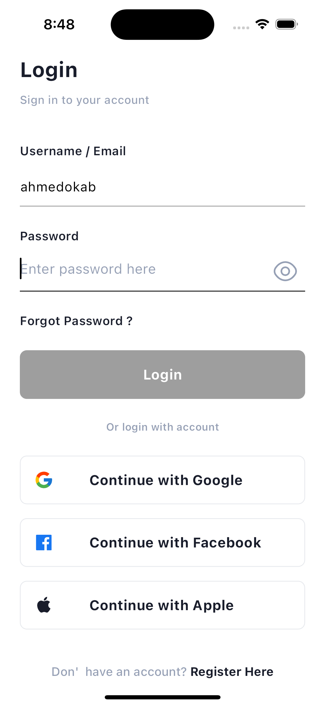

# Ringo-Media---Flutter-Dev-test

## Overview

 Login Screen 

 Project Summary
 
 

This project features a login interface, a project summary screen, and a calendar for scheduling tasks.

## Demo Video

For a detailed walkthrough, check out the [demo video](http://www.youtube.com/watch?v=VIDEO_ID) on YouTube.

